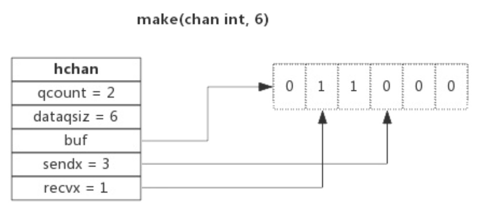

# chan 数据结构

`src/runtime/chan.go:hchan` 定义了channel 的数据结构，由队列、类型信息、goroutine 等待队列组成

```go 
type hchan struct {
	qcount   uint           // 当前队列中剩余元素个数
	dataqsiz uint           // 环形队列长度，即可以存放的元素个数
	buf      unsafe.Pointer // 环形队列指针
	elemsize uint16 // 每个元素的大小
	closed   uint32 // 标识关闭状态
	elemtype *_type // 元素类型
	sendx    uint   // 队列下标，指示元素写入时存放到队列中的位置
	recvx    uint   // 队列下标，指示元素从队列的该位置读出
	recvq    waitq  // 等待读消息的 goroutine 队列
	sendq    waitq  // 等待写消息的 goroutine 队列

	// lock protects all fields in hchan, as well as several
	// fields in sudogs blocked on this channel.
	//
	// Do not change another G's status while holding this lock
	// (in particular, do not ready a G), as this can deadlock
	// with stack shrinking.
	lock mutex // 互斥锁，chan 不允许兵法读写
}
```

## 环形队列

chan 内部实现了一个环形队列作为其缓冲区，队列的长度是创建 chan 时指定的。
```
chanName := make(chan chanType, capacity)
```

- dataqsiz 指示了队列长度为 6，即可缓存 6 个元素
- buf 指向队列的内存，队列中还剩余两个元素
- qcount 表示队列中还有两个元素
- sendx 指示后续写入的数据的位置，取值 [0, 6）
- recvx 指示从该位置读取数据，取值 [0, 6）
  
## 等待队列

## 类型信息

## 锁

# channel 读写

## 创建 channel
`src/runtime/chan.go` 中定义的 `func makechan(t *chantype, size int) *hchan`

## 向 channel 写数据
`src/runtime/chan.go` 中定义的 `func chansend(c *hchan, ep unsafe.Pointer, block bool, callerpc uintptr) bool`

处理逻辑：
1. 如果等待接收队列recvq不为空（说明缓冲区中没有数据或者没有缓冲区），此时直接从recvq取出G，并把数据写入，最后把该G唤醒，结束发送过程;
2. 如果缓冲区中有空余位置 (`c.qcount < c.dataqsiz`)，将数据写入缓冲区，结束发送过程;
3. 如果缓冲区中没有空余位置，将待发送数据写入G，将当前G加入sendq，进入睡眠，等待被读goroutine唤醒;

## 从 channel 读数据
`src/runtime/chan.go` 中定义的 `func chanrecv(c *hchan, ep unsafe.Pointer, block bool) (selected, received bool)`

处理逻辑：
1. 如果等待发送队列sendq不为空（`sg := c.sendq.dequeue(); sg != nil`）
   - 如果没有缓冲区（`c.dataqsiz == 0`），直接从sendq中取出G，把G中数据读出，最后把G唤醒，结束读取过程;
   - 如果有缓冲区，此时说明缓冲区已满，从缓冲区中首部读出数据，把G中数据写入缓冲区尾部，把G唤醒，结束读取过程;
2. 如果缓冲区中有数据（`c.qcount > 0`），则从缓冲区取出数据，结束读取过程;
3. 将当前goroutine加入recvq，进入睡眠，等待被写goroutine唤醒;

## 关闭channel
`src/runtime/chan.go` 中定义的 `func closechan(c *hchan)`

处理逻辑：
1. 把 recvq 中的 G 全部唤醒，本该写入 G 的数据位置为 nil
2. 把 sendq 中的 G 全部唤醒，但这些 G 会 panic

除此之外，panic出现的常见场景还有:
1. 关闭值为nil的channel（`c == nil`）
2. 关闭已经被关闭的channel（`c.closed != 0`）
3. 向已经关闭的channel写数据（`c.closed != 0` in `chan.go:chansend`）

# 常见用法

## 单向 channel
单向 channel 指只能用于发送或接收数据。实际上没有单向 channel，所谓的单向 channel 只是对 channel 的一种使用限制。

## select
select 用于监控多个 channel，当其中某一个 channel 有数据时，就从其读出数据。通常搭配 for 使用。例如：
```go
chan1 := make(chan int, 10)
chan2 := make(chan int, 10)
for {
	select {
	case e := <- chan1:
		//...
	case e := <- chan2:
		// ...
	default:
		//....
	}
}
```

**select的case语句读channel不会阻塞**，尽管channel中没有数据。这是由于case语句编译后调用读channel时会**明确传入不阻塞的参数**，此时读不到数据时不会将当前goroutine加入到等待队列，而是直接返回。

## range
通过range可以持续从channel中读出数据，好像在遍历一个数组一样，
- 当channel中没有数据时会阻塞当前goroutine，与读channel时阻塞处理机制一样。
- 当 channel 被关闭时，则 for 循环会退出。

使用方式如下：
```go
for e := range chanName {
	//...
}
```
